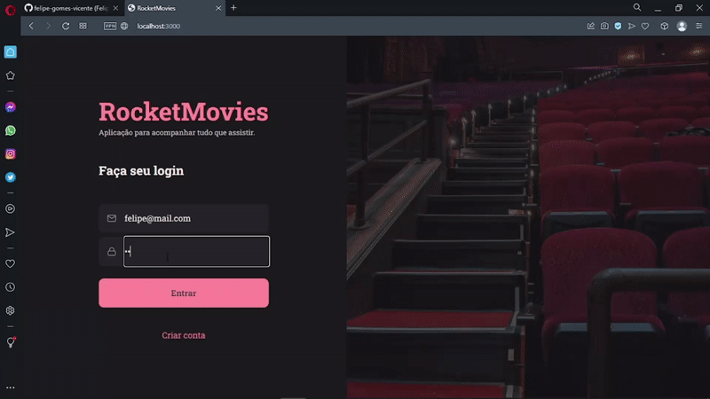
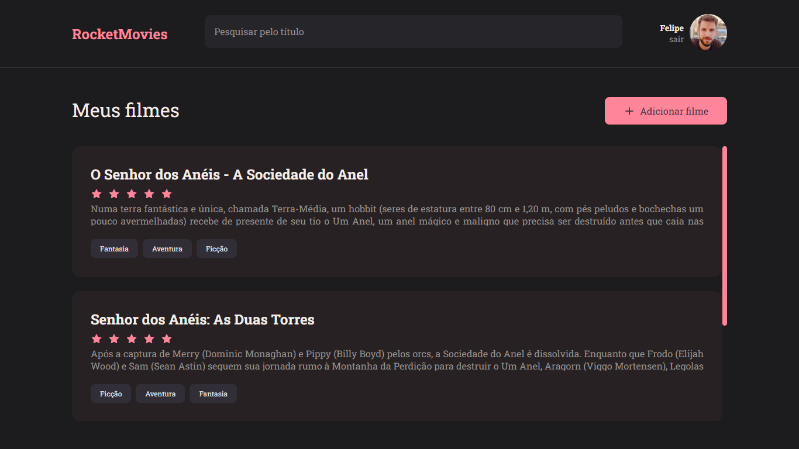

# Rocket Movies

<h1 align="center">
    
</h1>

<br>

### 💻 Rocket Movies 

Building a Rocket Movies application in Front End with ReactJS and Vite.
Application to save, rate and manage your favorite movies.

Watch it in action Deploy: [Click Here](http://rocket-movies-front-end.vercel.app/)

Login User: felipe@mail.com  
Password: 123

What was developed:

- Logic and Algorithms with Javascript;
- Use the Vite;
- Deploy Front end Vercel, deploy back end heroku;
- Style and format application with Styled Components;
- Hooks User authentication;
- Building the application in blocks with components with the ReactJS tool;
- Navigation with React Router Dom;
- Data immutability;
- Promises with Async Await;
- Route mapping;
- Asynchronous and promises;
- Object orientation;
- Data types in javascipt;
- Functions Callbacks;
- Context API;
- ES6 Modules;
- Project file system structure files and folders;

<br />
<p>Rocket Movies</p>


<br />
## 🧪 Tools

Application developed using the following tools:


- [React](https://reactjs.org)
- [Rocket Movies Api](https://github.com/felipe-gomes-vicente/rocket-movies-api)
- [Javascript](https://developer.mozilla.org/pt-BR/docs/Web/JavaScript)
- [React-router-dom](https://reactrouter.com/web/guides/quick-start)
- [Styled Components](https://styled-components.com/)
- [Vite](https://vitejs.dev/)


## 🚀 Getting started

Clone Project and access folder and start the server it is necessary to have NodeJs
installed and Visual Studio Code.

### Programs needed to Getting started

- [NodeJS](https://nodejs.org/en/)
- [Visual Studio Code - Vscode](https://code.visualstudio.com/)
- 
  
<br />

### Install server and start up

```bash
$ git clone https://github.com/felipe-gomes-vicente/rocket-movies-api.git
$ cd rocket-movies-api
$ npm install
$ npm run dev
```
PORT Server localhost:3333

<br />

Clone the project and access the folder

```bash
$ git clone https://github.com/felipe-gomes-vicente/rocket-movies-front-end.git
$ cd rocket-movies-front-end
```

<br />

## 📝 License

This project is under the MIT license. See the file [LICENSE](LICENSE) for more details.

---

&nbsp;

<p align="center">Done with 💜 by Felipe Vicente👋</p>

- ## My LinkedIn - [](https://www.linkedin.com/in/felipe-gomes-vicente/)
